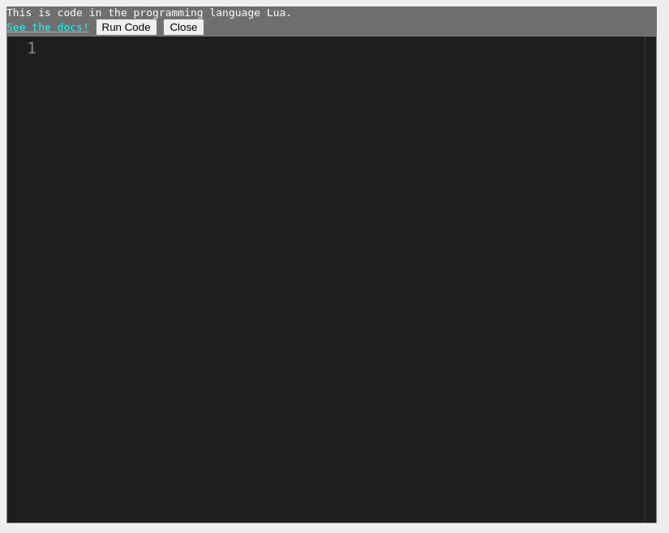
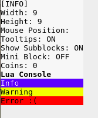
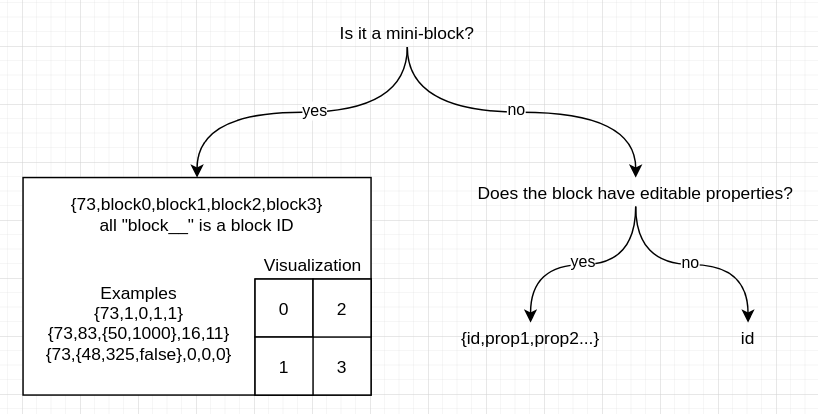

# just a level editor Lua Documentation


`just a level editor` now supports writing custom code for levels in the programming language Lua!

# Table of Contents

- [Introduction](#introduction)
  - [Code Editor](#code-editor)
  - [Lua Console](#lua-console)
  - [Thinks You Should Know](#things-you-should-know)
- [The Actual Docs](#the-actual-docs)
  - [Global Variables](#global-variables)
    - [`keep`](#keep)
  - [Functions](#functions)
    - [`layer`](#layer)
    - [`html` \[BETA\]](#html-beta)
- [Appendix A: The Anatomy of a Block](#appendix-a-the-anatomy-of-a-block)
- [Appendix B: Block IDs](#appendix-b-block-ids)
- [Appendix C: Player Properties](#appendix-c-player-properties)
- [Appendix D: Running Javascript Code](#appendix-d-running-javascript-code)

# Introduction

There are 2 keybinds that you use to tinker with and debug code.
- `8` - Open the code editor
- `9` - Open/close the console

## Code Editor

The code editor looks and functions just like the code window for [Visual Studio Code](https://code.visualstudio.com/).

- The `[ Run Code ]` button updates the code that is being ran.
- The `[ Close ]` button returns to the game.
- The main game doesn't process inputs when the code editor is open (besides keybinds the code sets).



## Lua Console

The console resides on the top-left of the screen, right below the info section. You can make messages with different color backgrounds depending on what their purpose is. The console holds up to 10 messages

- Blue: Info/Debug
- Yellow: Warning
- Red: Error



## Things You Should Know

- **The code runs every frame!** There is a way to make code only run the first frame, but we'll get in to that later.

- Global variables are not preserverd between times the code runs, but just like the last note, there's a way to transfer data between runs.

- If the code encounters an error, you'll need to restart the code yourself.

- There is no Ctrl-S or whatever to save your code. Just click the `[ Run Code ]` button in the code editor to update your code!

- If a level is saved, the code gets saved with it. If a level is exported, the code gets exported with it.

- Even if you're not going to use everything in the docs, it's still best to read them all quickly just so you know what's possible.

# The Actual Docs

## Global Variables

- `dt`: The amount of time that has passed (in milliseconds) since the last time the code ran.

- `isFirstRun`: `true` if it's the first frame since `[ Run Code ]` was pushed or a level was loaded, `false` otherwise. Good for only doing something once.

- `pressedKeys`: A table that starts with nothing, but gradually contains more keys as they are pressed. When the browser tab is first opened, it's blank, but as the level is played, it starts to look like this:
  ```lua
  {
  	d = false,
  	w = false,
  	a = true
  }
  ```
  pretty much every key is supported. If you want to find out what a key would be listed as, press a key then check the `e.key` value at [jskeycode.info](http://jskeycode.info/).

- `isDead`: If the player is currently in the animation of dying.

- `justDied`: If the player has died the frame before. Doesn't work if you kill the player via the code, for now...

- `hasJSPerms`: If the user has accepted a request for the permission to run Javascript code.

### `keep`

`keep` is the only variable that is saved between runs of the code. It is initialized as a blank table (`{}`). It can be anything besides a function.

## Functions

Functions will be shown as such: `functionName(properties):returnType`. If `returnType` is `void`, no value is returned from the function.

- `setBlock(x, y, block):void`: Sets a block at the specified coordinates with the block `block`. See Appendix A (and B) for more info on blocks.
  ```lua
  -- puts a death block at the top left of the level.
  setBlock(0, 0, 2);
  ```

- `getBlock(x, y):block`: Get the block at the specified coordinates. See Appendix A (and B) for more info on blocks.

- `setPlayerColor(r, g, b):void`: Set the color of the player. `r`, `g`, and `b` go from 0 to 255.

- `getPlayerColor():{r,g,b}`: Returns the current color of the player, wether custom or not. Doesn't account for transparency (if there is not a custom color currently active).

- `getOption(opt):optValue`: Get the value of an option.
  ```lua
  getOption("darkMode"); -- boolean
  getOption("spawnDelay"); -- number (NOT actually the spawn delay--it's (optValue*100)/3)
  getOption("timer"); -- boolean
  getOption("wipeConfirm"); -- boolean
  ```

- `setCoords(x, y):void`: Set the player's coordinates. 1 in-game block translates to 50 x or y.
  ```lua
  -- 1 block in
  setCoords(50, 50);
  -- top left
  setCoords(0, 0);
  ```

- `getProp(prop):propVal`: Get a player property. See Appendix C for all possible properties.

- `setProp(prop, value):void`: Set a property. See Appendix C for all possible properties, and what you should set them to.

- `getWidth():number`: Get the width of the level.

- `getHeight():number`: Get the height of the level.

- `print(msg):void`: Print a message with a blue background to the console.

- `warn(msg):void`: Print a message with a yellow background to the console.

- `error(msg):void`: Print a message with a red background to the console.

- `lock(prevent):void`: Prevent the player from doing certain actions. `prevent` is a table with the values `teleporting`, `building`, `godMode`, `noclip`, and `panning`, prevent you from doing it if the property is `true`, but letting you do it if the property is `false`.

- `fill(x, y, w, h, block):void`: Fill a rectangle with one type of block. `x` and `y` determine where the rectange starts, while `w` (width) and `h` (height) determine how large it is, and `block` determines what is filled (see Appendix A).

- `respawn(start):void`: Respawn the player. Doesn't work with the `justDied` global variable. `start` is a boolean which is `true` if you want the player to return to the start, but `false` if it's only to the most recent checkpoint.

## `layer`

There will probably be more layer functionality in the future.

The layer is a canvas above all the other canvases, but below the U.I. If you want to tint the level or something, you can do that!

- `layer.clear():void`: Fully clear the layer.

- `layer.filter(r, g, b, intensity):void` Tint the layer. `r`, `g`, and `b` go from 0 to 255, while `intensity` goes from 0 to 1, where 1 is a solid fill and 0 does nothing.

## `html` [BETA]

**This is in beta. It lacks a lot of functionality. Try coming back later?**

Create HTML elements below the regular U.I, but still above `layer`.

Elements persist between frames. You don't need to re-make them.

This is marked as beta because, for now, there is very limited functionality. There will be more later.

The only `type` so far is `"text"`. The only 

- `html.new(type, id, text, style):void`: Create a new HTML element. `type` can be `"text"`, `id` is a unique ID for the element, and `text` is the content of the element (if any).
  `style` is a table with info on positioning, size, and appearance.
  ```lua
  html.new("text", "myText", "Hello World!" {
	  -- Distance from edge
	  top = "100px",
	  left = "100px",
	  bottom = "100px",
	  right = "100px",
	  -- If you use all 4 distances from edge,
	  -- width/height don't work.
	  width = "50%",
	  height = "30vh",
	  -- Appearance
	  color = "red",
    padding = "10px 20px 30px 40px",
    textAlign = "center",
    -- lineHeight = "20px",
    fontSize = "18px"
  });
  ```

- `html.id(id):japElement`: Get some utility functions for the element with the ID `id`.
  
  `japElement` is a table containing for now, just one function.
  ```lua
  {
    center = "(no args) (no return) centers the element."
  }
  ```

# Appendix A: The Anatomy of a Block

Here's a helpful flowchart showing you how you should figure out how a block is stored in the code.

See Appendix B for all possible values of `id`.



# Appendix B: Block IDs

Each block has an ID assigned to it. This is a comprehensive list of each block, and it's ID.

<!--
Generate this appendix with this code:
blockName.map((n, i) => `${i}. ${n}`).join("\n")
-->

0. Empty Space
1. Solid Block
2. Death Block
3. Check Point
4. [REMOVED]
5. Bounce Block
6. G-Up Field
7. G-Down Field
8. G-Low Field
9. G-Medium Field
10. G-High Field
11. Wall-Jump Block
12. 0-Jump Field
13. 1-Jump Field
14. 2-Jump Field
15. 3-Jump Field
16. Inf-Jump Field
17. Start
18. Goal
19. [REMOVED]
20. [REMOVED]
21. S-Slow Field
22. S-Normal Field
23. S-Fast Field
24. Bounce Block++
25. G-Bounce Up
26. G-Bounce Down
27. Force Field L
28. Force Field R
29. Force Field U
30. Force Field D
31. Switch Block
32. Toggle Block A
33. Toggle Block B
34. Toggle Death Block A
35. Toggle Death Block B
36. Timer Block A
37. Timer Block B
38. Timer Death Block A
39. Timer Death Block B
40. Ice Block
41. Portal
42. Jump Block A
43. Jump Block B
44. Jump Death Block A
45. Jump Death Block B
46. Text Block
47. Custom Bounce Block
48. Custom G-Field
49. Custom Jump Field
50. Custom Speed Field
51. Colored Solid Block
52. Custom Toggle Block
53. Custom Timer Block
54. Custom Jump Block
55. One-Way Block L
56. One-Way Block R
57. One-Way Block U
58. One-Way Block D
59. G-Left Field
60. G-Right Field
61. G-Bounce Left
62. G-Bounce Right
63. Timer Interval Field
64. Size Small Field
65. Size Medium Field
66. Size Large Field
67. Custom Size Field
68. Time Slow Field
69. Time Normal Field
70. Time Fast Field
71. Custom Time Field
72. Unstable Block
73. Mini Blocks
74. Colored BG Block
75. Chain Start
76. Chain Block
77. Coin
78. Coin Block A
79. Coin Block B
80. Coin Death Block A
81. Coin Death Block B
82. Custom Coin Block
83. Vacuum

# Appendix C: Player Properties

If the name isn't self-explanatory, There will be a comment on what purpose it serves. There is also the type each property is.

- `gravity:number`
- `sidewaysGrav:boolean`
- `maxJumps:number`
- `currentJumps:number`: How many times the player can currently jump.
- `speed:number`: How fast the player moves (compared to `gameSpeed:number`).
- `size:number`: The size that the player should gradually transition to.
- `realSize:number`: The size the player currently is. If you change this, you might want to change `size` too!
- `gameSpeed:number`: Multiplier to how fast the game runs.
- `timerInterval:number`
- `x:number`: The player's x coordinate.
- `y:number`: The player's y coordinate.
- `xv:number`: The current x velocity of the player.
- `yv:number`: The current y velocity of the player.
- `coins:number`: How many coins the player currently has.
- `timer:boolean`: The current state of the timed blocks.

# Appendix D: Running Javascript Code

- Use the global variable `hasJSPerms` to check if you can run code.
- Use the function `requestJSAccess` to ask the user if you can run code.
- Once your request has been accepted, run code with the `evalJS` function. 